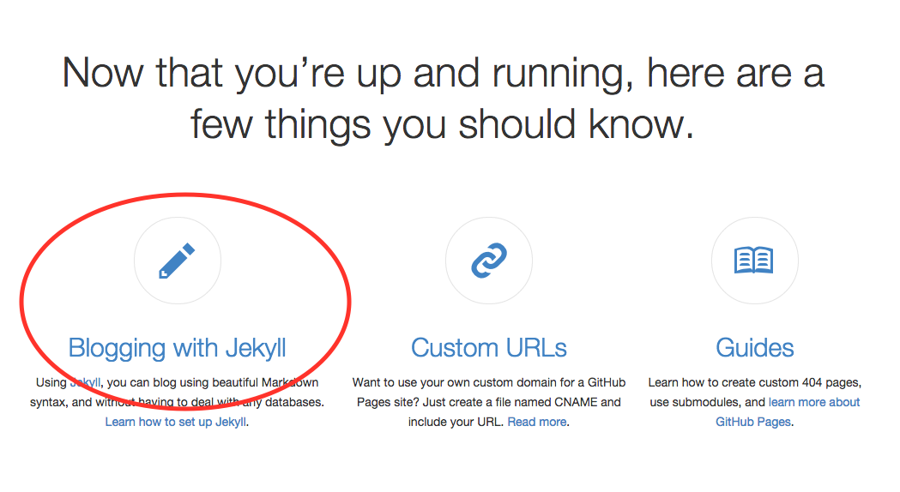

Title: 从0开始搭建github.io博客
Date: 2014-09-08
Tags: github.io, blog
Category: 其它
Slug: github.io博客
Author: dav

这几天浏览博客，发现有很多 `userName.github.io` 的博客，布局和主题比较美观，如[这里](http://wanglongqi.github.io)，本着寻根问底的态度，google之；

#### 1，首先找到了[github的pages](https://pages.github.com)，按github引导一步步完成。
<div class="message" style="font-size: 15px">
非常好，看起来没有任何问题~，但是博客里只有个<em>"Hello World"</em>。ok，接下来，就是添加博客内容了，看页面的最下边。
</div>


#### 2，博客框架jekyll，安装配置见[官网](http://jekyllcn.com)，有详细教程；或者按照[github的pages](https://help.github.com/articles/using-jekyll-with-pages)直接操作也行，网上也有教程，一搜一大堆。推荐这两个:
* [搭建一个免费的，无限流量的Blog----github Pages和Jekyll入门](http://www.ruanyifeng.com/blog/2012/08/blogging_with_jekyll.html)
* [一步步在GitHub上创建博客主页](http://www.pchou.info/web-build/2013/01/03/build-github-blog-page-01.html)

<div class="message" style="font-size: 15px">
对Jekyll基本了解后，就可以开干了，找一个合适的主题，我用的是[hyde](https://github.com/poole/hyde)，git clone下来，粘贴到github.io对应的目录下，然后修改css，达到自己想要的效果；
</div>

#### 3，push git后就能看到博客了。

#### 4，添加评论，参考[这里](http://joeyio.com/jekyll/2013/04/13/how-to-use-uyan-in-Jekyll/)
<div class="message" style="font-size: 15px">
经测试，只用把以下代码，粘贴到html的任一地方就OK了。
```javascript
<!-- UY BEGIN -->
<div id="uyan_frame"></div>
<script type="text/javascript" id="UYScript" src="http://v1.uyan.cc/js/iframe.js?UYUserId=YOUR_USER_ID" async=""></script>
<!-- UY END -->
```
</div>
-----

其中，最为费事的是`css`修改，本人`html，css`0基础啊，泪奔~
