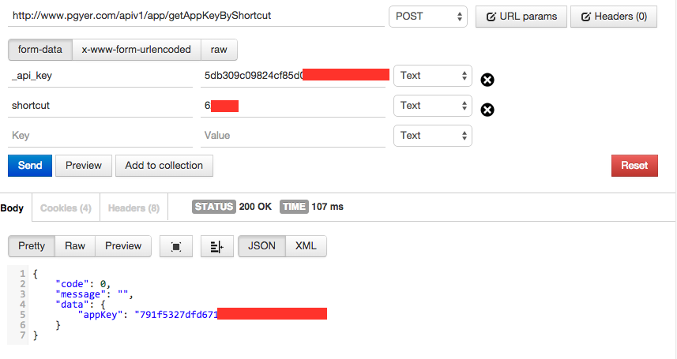

ios打包测试工具 - [浦公英](http://www.pgyer.com/)  介绍与使用

Android的测试非常方便，放到服务器上，生成个链接，就可以安装测试了；

但是，因为apple的安全策略，ios应用测试一直是我等开发者最为头疼的问题之一。__（如果你有299刀的企业账号，这自然不是问题了）__

以前用[TestFlight](https://testflightapp.com)进行分发测试，基本可以完成需要。就是上传和下载时会比较慢__（因为是国外的网站）__;

最近发现了这个浦公英，试了下，还不错，原理也是基于apple企业账号的，注册个账号，上传应用ipa，使用[验证App短链接](http://www.pgyer.com/doc/api)接口
```html
http://www.pgyer.com/apiv1/app/getAppKeyByShortcut
```
得到appkey；以下是用postman得到的结果
  

最后生成安装链接

```html
http://www.pgyer.com/apiv1/app/install?aKey=791f5327dfd671300fac21ed7d4c****&_api_key=5db309c09824cf85d0252b530240****&password=****
```

直接把这个链接发给测试人员就行了，复制到iOS设备的`Safari`中访问就可以安装测试了。

*有需要的朋友，赶紧去试试吧~*
